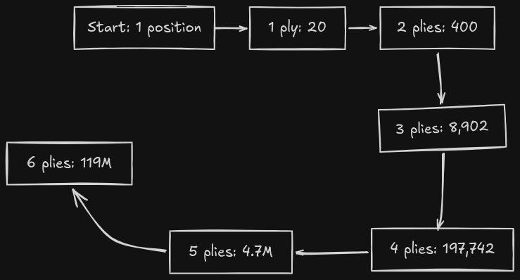
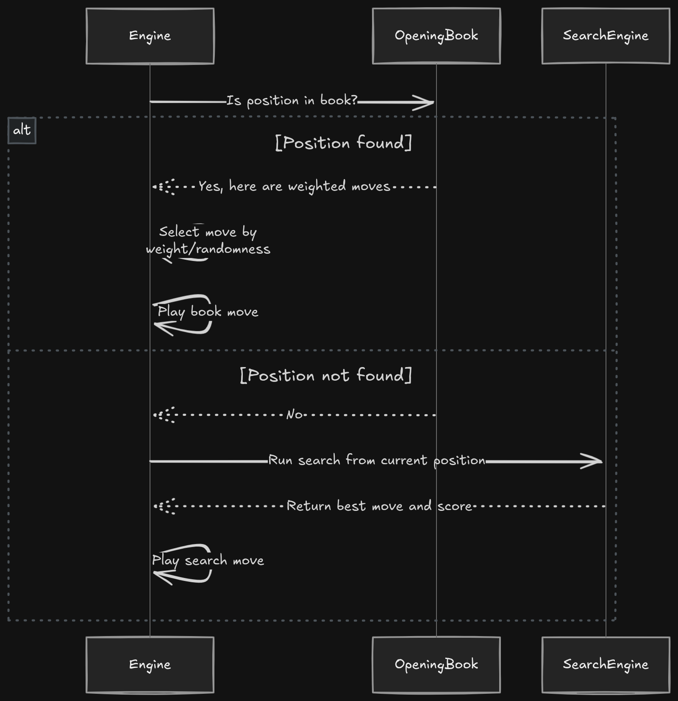
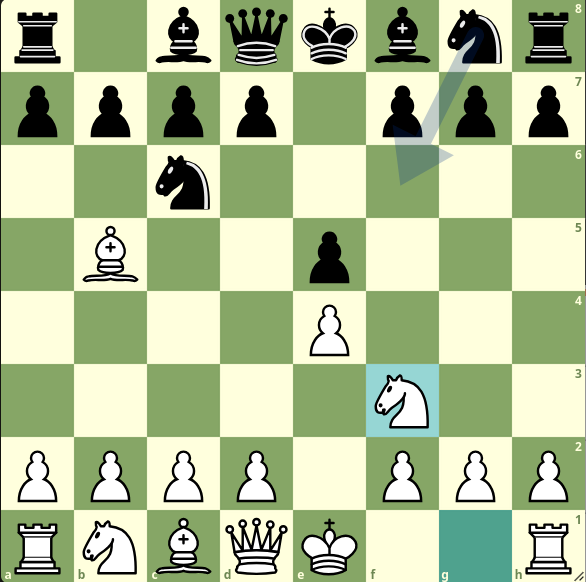

> Cover image source: [lexica.art](https://lexica.art/prompt/4be7a320-626d-41ed-a1c0-1fb2e6b14dc3)


Chess engines have a real problem in the opening phase. The position is too complex for brute-force calculation from move one, yet the opening is exactly where engines are most exposed. They're excellent at calculating tactics and evaluating material imbalances in the middlegame and endgame. But the opening is a different beast. The branching factor is enormous, and the strategic considerations are long-term, subtle, and often don't show up on the board for another 15 moves.

From the starting position, White already has 20 legal moves. After just two moves each, that number jumps to more than 8,900 possible positions roughly. By move four, it grows to over 197,000. And it keeps increasing at an [exponential](https://en.wikipedia.org/wiki/Exponential_function) rate.([Chess - OeisWiki](https://oeis.org/wiki/Chess))

Modern engines go a step further with neural network evaluations. For example, Stockfish uses [NNUE](https://en.wikipedia.org/wiki/Efficiently_updatable_neural_network), which helps the engine evaluate positions it has never seen before. This is especially useful in the opening, where it allows the engine to rely less on memorized lines and more on general understanding.

What’s interesting is how these pieces work together in practice. Engines use opening books to move through well-known theory without spending time on calculation. Once they reach something unfamiliar, they switch to evaluation and search to figure things out. On top of that, modern engines use machine learning to discover new ideas through self-play.It’s not a single method so much as a spectrum. On one side, you have pure memorization. On the other, pure calculation. Today’s engines sit somewhere in the middle, combining both depending on the position.

# Why Openings Are Hard for Engines

The core problem is [Combinatorial explosion](https://en.wikipedia.org/wiki/Combinatorial_explosion). Chess has an average branching factor of around 35 moves per position in typical middlegame play. In the opening, it's higher because the position is open and tactical constraints are minimal.

Here's how quickly position counts grow from the starting array:


| Piles                 | Positions    |
| --------------------- | ------------ |
| 0(start)              | 1            |
| 1(White's first move) | 20           |
| 2 (Black's response)  | 400          |
| 3                     | ~8,092       |
| 4                     | -197,742     |
| 5                     | ~4.8 million |
| 6                     | ~119 million |



Even a shallow search can get out of hand. Looking just 6 plies ahead, which is only three moves each, already means evaluating over 100 million positions. Engines can process millions of positions per second, but spending that effort on every opening move is wasteful. Many of those positions are effectively the same from a strategic point of view.

Humans and engines handle this phase very differently. Humans rely on pattern recognition, long-term understanding, and memorized ideas built from study and experience. They can look at a position and understand why a move makes sense. Traditional engines work the other way around. They assign numerical scores to positions and calculate concrete variations.

This leads to a tricky evaluation problem in the opening. There are usually no immediate tactics to latch onto. Instead, the position is shaped by small, long-term factors like piece activity, pawn structure, and space. These advantages might not become clear until 10 or 20 moves later. Because of that, an engine might see two opening moves as almost equal, while human theory strongly prefers one based on deeper strategic understanding.

To see just how fast the numbers get out of hand:

```python
def estimate_nodes(branching_factor, depth):
    nodes = 0
    for d in range(depth + 1):
        nodes += branching_factor ** d
    return nodes

# Branching factor of 20 in the opening
print("Nodes to depth 4:", estimate_nodes(20, 4))   # ~168,421
print("Nodes to depth 6:", estimate_nodes(20, 6))   # ~67M
print("Nodes to depth 8:", estimate_nodes(20, 8))   # ~26.9B
```


```bash
Nodes to depth 4: 168421  
Nodes to depth 6: 67368421  
Nodes to depth 8: 26947368421
```

Searching to depths where engine evaluation becomes reliable (typically 12+ plies for tactical positions) would require billions of node evaluations for just the first few moves. Opening books exist to skip all of that.

# Opening Books and Databases

An opening book is a precomputed database of chess positions and associated moves, representing established theory. When an engine receives a position, it first checks whether that position is in its opening book. If found, the engine selects a move from the book (often with some weighting to avoid being predictable) and plays it instantly, no search required. Only when the position isn't in the book does the engine invoke its normal search process.

## Polyglot Books

The Polyglot format is one of the most widely used formats in computer chess. It is designed as a simple, well-documented binary format for opening books. Instead of storing positions directly, it identifies them using a Zobrist hash key.

Each entry in a Polyglot book contains:
- A 64-bit Zobrist hash of the position
- The recommended move (encoded as source and destination squares)
- A weight indicating the move's popularity or effectiveness
- A learn value (used by some engines for book learning)

Stockfish, Komodo, and most UCI-compatible engines support Polyglot books.

A simplified Polyglot book entry looks like this:
```text
Bytes   Field        Size    Description
0–7     key          8 bytes  64-bit Zobrist hash of the position
8–9     move         2 bytes  Encoded move
10–11   weight       2 bytes  Move weight (preference/frequency proxy)
12–15   learn        4 bytes  Learning value (used by some engines)
```

Each entry is a compact, fixed-size record:
```text
[8 bytes key][2 bytes move][2 bytes weight][4 bytes learn]
```


## PGN Databases

Portable Game Notation (PGN) is a text-based format for recording chess games. It's not as efficient for lookup as binary books, but PGN databases are the raw material from which opening books get built. Engines can use PGN files directly by searching for matching positions, though it's slower. Common PGN sources include TWIC (The Week in Chess), ChessBase game databases, FIDE-rated game collections, and engine tournament games.

PGN example:
```text
[Event "Live Chess"]
[Site "Chess.com"]
[Date "2026.04.20"]
[Round "?"]
[White "JeyBe6"]
[Black "masterbr1an"]
[Result "1-0"]
[TimeControl "600"]
[WhiteElo "775"]
[BlackElo "772"]
[Termination "JeyBe6 won by checkmate"]
[ECO "D00"]
[EndTime "8:37:55 GMT+0000"]
[Link "https://www.chess.com/game/live/167561955386?move=0"]

1. d4 d5 2. e3 Nc6 3. Nf3 Bf5 4. Bd3 e6 5. Bxf5 exf5 6. O-O Bd6 7. Nc3 Nf6 8. a3
Ne4 9. Nxd5 Qd7 10. b4 O-O-O 11. c4 Nxd4 12. exd4 Nc3 13. Nxc3 f4 14. c5 Be7 15.
d5 Qg4 16. h3 Qh5 17. Bxf4 g5 18. Bxg5 Bxg5 19. Nxg5 Qxg5 20. Ne4 Qxd5 21. Qxd5
Rxd5 22. Nf6 Rf5 23. Ne4 Re8 24. Rfe1 Rfe5 25. Nf6 Rxe1+ 26. Rxe1 Rxe1+ 27. Kh2
Ra1 28. Nxh7 Rxa3 29. Ng5 f6 30. Ne6 Kd7 31. Nd4 Rd3 32. Nf3 Kc6 33. Ne1 Rb3 34.
Nc2 Kb5 35. Nd4+ Kc4 36. Nxb3 Kxb3 37. h4 Kxb4 38. h5 a5 39. h6 a4 40. h7 a3 41.
h8=Q Kb3 42. Qxf6 a2 43. g4 Kc2 44. Qa1 Kb3 45. g5 b6 46. g6 bxc5 47. g7 c4 48.
g8=Q c5 49. f4 Ka3 50. f5 c3 51. Qgxa2+ Kb4 52. Qa4# 1-0
```

## Human-Made Vs. Automatically Generated Books

Opening books come from two sources. Human-made books are curated by chess experts who select moves based on grandmaster games, theoretical novelties, and strategic judgment. Automatically generated books process large game databases with engines to find what performs best statistically.

Human-made books tend to have better strategic nuance and exclude dubious lines that score well in engine vs. engine play but fall apart against human creativity. Automated books can process far more data and adapt to new trends quickly but may miss subtleties that experienced annotators would catch.





:::note
Opening books go stale. A book that was state-of-the-art five years ago may contain lines that have since been refuted by new engine analysis. Regular updates matter for competitive play, especially in popular openings where theory moves quickly.
:::


# How Engines Transition out of Theory

An engine is "in book" when the current position exists in its opening book. It's "out of book" when the position isn't found, requiring it to fall back on search and evaluation. The transition point matters a lot because it's where memorized theory ends and independent calculation begins.

The transition can happen for several reasons. A novelty move (either player plays something not recorded in the book), the position exceeds the book's depth limit, or the specific variation or move order simply isn't covered.

When deciding whether to stay in the opening book or start calculating, engines look at a few practical factors. They consider the position itself, since some engines will leave the book early if the suggested move leads to something clearly worse. Time also matters. In time pressure, sticking to book moves avoids spending precious seconds on calculation.

They also take move selection into account. An engine might steer away from sharp, heavily analyzed lines and choose something quieter instead. On top of that, transposition tables play a role. If the same position shows up through a different move order, the engine can still recognize it and reuse what it has already learned.

:::tip
Engines sometimes deliberately avoid the most popular book move. If the main line leads to a deeply theoretical variation, an engine might choose a sounds good but less popular alternative to steer into territory where its calculation strengths matter more. This comes up often in engine vs. engine matches where dodging preparation can be a real advantage.
:::

Transposition tables smooth the transition considerably. These hash tables store previously searched positions and their evaluations, so an engine can reuse earlier work even when it reaches familiar positions through different move orders. A position reached via `1.e4 e5 2.Nf3 Nc6 3.Bb5` is the same position as one reached via `1.e4 e5 2.Bb5 Nc6 3.Nf3`. If the engine has already analyzed it once, it doesn't start from scratch the second time.




# Modern Engines, Neural Networks, and Self-Play 

Neural networks have changed how engines handle the opening in ways that weren't fully anticipated even a decade ago. Engines like Stockfish (with NNUE), Leela Chess Zero, and AlphaZero learn to evaluate positions directly from training data rather than relying on hand-crafted evaluation functions.

## NNUE in Stockfish 

Stockfish's NNUE (Efficiently Updatable Neural Network) replaced the traditional hand-tuned evaluation function with a neural network trained on millions of engine-generated positions to predict game outcomes from any position.

What this means for the opening is NNUE can recognize subtle positional features that traditional evaluation missed, generalize to positions never seen before based on similarity to training data, update incrementally rather than recomputing the full network for each move, and improve as more training data is added.

The efficiency comes from a few specific techniques. Incremental updates mean only the changed portions of the network get recomputed after each move. Quantization uses 8-bit or lower precision weights to cut memory bandwidth requirements. Sparse input representation makes the feature transformation fast to compute. In practice, Stockfish evaluates millions of positions per second even with NNUE. Better evaluation quality also improves pruning decisions, reducing the number of nodes searched and partly offsetting the higher per-node cost.

## Leela Chess Zero and AlphaZero

Lc0 and AlphaZero take a different approach entirely. Deep neural networks combined with Monte Carlo Tree Search (MCTS), trained through self-play from scratch, with no human knowledge fed in beyond the rules of chess.

In the opening, these engines develop understanding purely from self-play experience. They regularly discover ideas that contradict established theory. They show stylistic tendencies that differ from human players (Lc0's affinity for certain flank openings is well documented). And they require much less explicit book support because their positional understanding is strong enough to navigate early play without it.

| Feature                | Stockfish (NNUE)                                 | Leela Chess Zero                     | AlphaZero                                               |
| ---------------------- | ------------------------------------------------ | ------------------------------------ | ------------------------------------------------------- |
| Training method        | Supervised learning on engine positions          | Self-play reinforcement learning     | Self-play reinforcement learning                        |
| Evaluation             | Neural network (NNUE)                            | Deep neural network                  | Deep neural network                                     |
| Search algorithm       | Alpha-beta pruning                               | Monte Carlo Tree Search              | Monte Carlo Tree Search                                 |
| Opening book use       | Still useful, less critical                      | Minimal; relies on NN evaluation     | None in original formulation                            |
| Notable opening traits | Follows theory closely, strong in tactical lines | Positional, sometimes unconventional | Aggressive, dynamic; sacrifices material for initiative |


Classical engines before NNUE relied on hand-crafted evaluation functions, deep opening books to compensate for weak opening evaluation, and aggressive pruning that sometimes missed positional nuances. Neural-network engines shift that balance. Better evaluation reduces book dependence, generalization from similar positions fills gaps in coverage, self-play generates novel ideas, and positional compensation (material sacrificed for activity or structure) gets understood more like a human player would understand it.

:::tip
Engines sometimes deliberately avoid the most popular book move. If the main line leads to a deeply theoretical variation, an engine might choose a sounds good but less popular alternative to steer into territory where its calculation strengths matter more. This comes up often in engine vs. engine matches where dodging preparation can be a real advantage.
:::

# Tools, Formats, and Ecosystem
The computer chess ecosystem around opening theory is larger than most people realize.

### Key tools:
- **ChessBase**: Industry-standard commercial database and analysis tool used by professionals and engine developers
- **SCID (Shane's Chess Information Database)**: Free, open-source alternative with robust game filtering and search
- **Arena**: Free GUI for chess engines with opening book support, engine tournaments, and analysis
- **Cute Chess**: Command-line and GUI tool built for engine vs. engine testing with sophisticated book handling
- **Polyglot**: Reference implementation for creating and managing Polyglot-format books
- **Opening Tree**: Web-based tool for visualizing opening statistics and move popularity

### Common file formats:
- **PGN (Portable Game Notation)**: Human-readable text format for chess games
- **EPD (Extended Position Description)**: Describes chess positions with annotations, used for test suites
- **BIN**: Binary format, often refers to Polyglot book files
- **Polyglot book files**: Specialized binary format for efficient opening book lookup

:::warning
Compatibility issues between engines and opening books are common. Not all engines support the same book formats, and even within supported formats there are implementation variations. Some engines expect Polyglot books to include specific metadata or handle learning values differently. Always verify that your engine supports the specific book format you're using and test that book lookups work correctly before relying on them in play.
:::

# Advanced Concepts and Future Directions

Several things are changing how opening theory gets handled as engine technology advances.

Dynamic opening books are shifting away from static, precomputed databases toward adaptive systems that update based on recent engine performance or new games. These books adjust move weights based on how lines perform in engine vs. engine play and can incorporate new games automatically.

Cloud analysis lets engines use distributed computing for deeper opening preparation. Services like ChessBase Cloud or Lc0's cloud analysis network give individual users access to analysis farms that would otherwise require dedicated server hardware.

Engine tournaments like TCEC (Top Chess Engine Championship) and the Chess.com Computer Chess Championship have become a real driver of opening theory development. Engine developers use these events to test new ideas, and the games themselves become valuable data for improving books.

Anti-book strategies involve deliberately playing moves designed to take opponents out of their opening preparation as quickly as possible. This includes rare sidelines, transpositions to unfamiliar structures, and positions where calculation matters more than memorization.

Personalized repertoires match opening books to an individual engine's or player's strengths. An engine that thrives in tactical positions might have a book built around sharp, double-edged openings. A more positional engine might focus on slower, maneuvering games.

Reinforcement learning approaches, following AlphaZero's lead, continue advancing. Future engines may rely less on static theory as their neural networks get better at evaluating opening positions from first principles.

# Conclusion

Modern engines use opening books to navigate theory efficiently, neural networks to evaluate unfamiliar positions, and search algorithms to calculate concrete variations when needed. No single method carries the full weight. The interplay between them is what makes current engines as strong as they are in the opening phase.

The transition from book play to independent calculation isn't a sharp cutoff. Engines typically stay in book for the first 10-15 moves in major openings, reaching playable middlegame positions with minimal compute. As they move past book coverage or hit a novelty, they rely more on evaluation and search, with neural networks providing increasingly precise positional judgment.

What's changed most in recent years is how blurry the line between "book" and "calculation" has become. NNUE and similar approaches let engines generalize from training data, evaluating positions they've never seen before with real accuracy. That reduces dependence on memorization while retaining the benefits of human-derived theory where it's reliable.


:::tip[Quote]
"The opening book is not a crutch for weak engines, but a tool for strong engines to reach positions where their strengths can be best utilized." - Inspired by discussions in computer chess forums and engineering documentation
:::

As engines keep improving, opening theory handling will become more integrated and less reliant on static databases. Neural networks will keep getting better at evaluating opening positions from first principles, while still benefiting from the collective knowledge in their training data. The goal stays the same: reach a playable middlegame where the engine's calculation and evaluation strengths can take over.

# References

- https://en.wikipedia.org/wiki/Chess_opening_book_(computers)
- https://www.chessprogramming.org/Polyglot_Opening_Book
- https://www.chessprogramming.org/Opening_Book
- https://www.youtube.com/watch?v=yAtVwiyXPxQ
- https://www.youtube.com/watch?v=4EVjP091WLU
- https://github.com/official-stockfish/Polyglot
- http://scid.sourceforge.net
- https://www.playwitharena.com
- https://cutechess.com
- https://lucaschess.github.io

# Further reading

**Books:**
- "Computer Chess: The First 50 Years" by Monty Newborn
- "Advances in Computer Chess" series
- "Artificial Intelligence and Computer Chess" by David Levy and Monty Newborn

**Tools:**
- ChessBase (https://www.chessbase.com)
- SCID (http://scid.sourceforge.net)
- Arena (https://www.playwitharena.com)
- Cute Chess (https://cutechess.com)
- Polyglot (https://github.com/official-stockfish/Polyglot)
- Lucas Chess (https://lucaschess.github.io)
