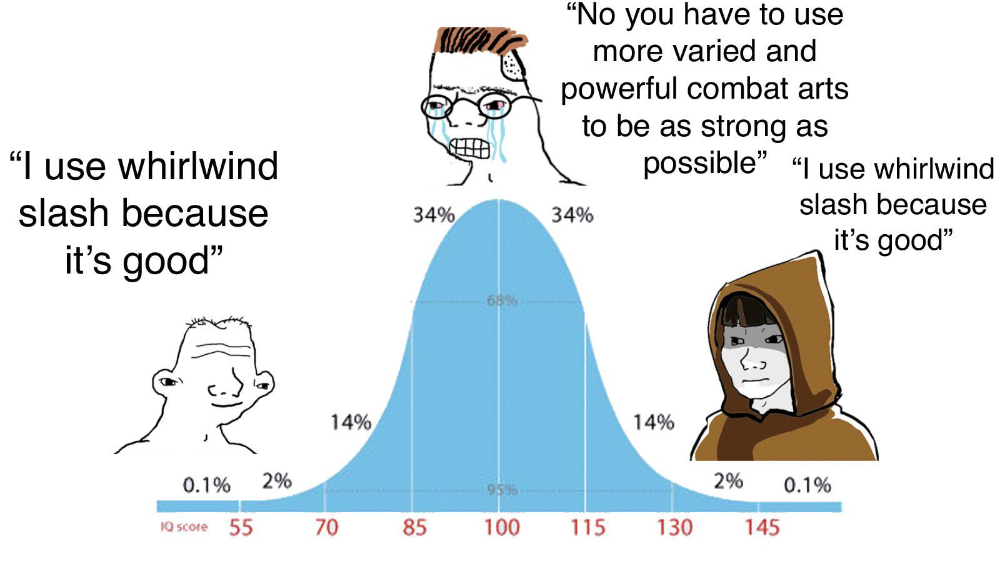

> Cover image source: [alphacoders.com](https://wall.alphacoders.com/big.php?i=1314885)

:::note
Sekiro: Shadows Die Twice revolutionized action game combat by replacing traditional health focused systems with a posture-based mechanic that emphasizes aggression, precision, and rhythm over dodging and stamina management. Its combat system transforms every encounter into a high-stakes sword duel where mastery comes from player skill rather than character stats, creating some of the most memorable and emotionally resonant boss fights in gaming history.
:::

# The Moment Sekiro Clicks

The first time I heard steel ring against steel atop Ashina Castle, I didn’t feel triumph.I felt panic. Genichiro Ashina stood before me, sword lowered, eyes locked, and every instinct screamed to back away, to create space, to think. But in Sekiro, backing away is often the worst thing you can do. I blocked his thrust, felt the shudder in my arms, and realized too late that I’d been thinking in Dark Souls terms: shield up, wait for an opening, punish. Sekiro doesn’t work that way.

As his combo came, a horizontal slash followed by a thrust,I tried to deflect, but my timing was off. The slash connected, breaking my posture. Before I could recover, the thrust pierced my guard. Death blinked red on the screen. I sighed, muttered **“Hesitation is defeat”** and tried again.

This moment, Dying not because I was weak, but because I was thinking wrong.This where Sekiro begins to teach. The game frustrates players initially because it demands a complete inversion of what many action games have trained us to do. For years, we’ve been taught that safety lies in distance, that blocking creates opportunity, that the best defense is a patient wait. Sekiro says: *get close, stay aggressive, and let your deflection be your shield.*

What makes this shift so profound is how it transforms combat from a statistical exercise into a rhythmic conversation. Health bars matter, yes, but they’re secondary to the yellow posture bar that pulses above each enemy’s head. Every blocked attack chips away at your own posture.Every successful deflection builds theirs. Victory isn’t about whittling down health through attrition.It’s about breaking their posture through perfectly timed aggression, leaving them open for a deathblow that ends the fight in a single, satisfying strike.

The phrase “Hesitation is defeat” isn’t just a meme. It’s a combat principle etched into every encounter. When you hesitate, you lose the initiative, you let the enemy dictate the pace, and you give them chances to break your posture. When you act, when you lean into the fight, trust your timing, and press forward, you take control. Sekiro doesn’t reward brute force or overleveling. It rewards the player who learns to read the flow of combat, to anticipate rather than react, and to find courage in the split second between an attack’s start and its impact.

:::important[Opinion]
The genius of Sekiro’s combat lies in how it makes mastery feel personal. There are no hidden stat checks, no gear walls to grind past. When you finally defeat **Genichiro** or any boss, It’s not because your numbers were high enough. It’s because you were good enough.
:::

---

<iframe width="560" height="315" src="https://www.youtube.com/embed/rXMX4YJ7Lks?si=TeoC0yGsIwnNYNo-" title="YouTube video player" frameborder="0" allow="accelerometer; autoplay; clipboard-write; encrypted-media; gyroscope; picture-in-picture; web-share" referrerpolicy="strict-origin-when-cross-origin" allowfullscreen></iframe>

<b>Sekiro: Shadows Die Twice - Official Launch Trailer | PS4</b>

---

# Why Sekiro Feels Different From Other Action Games

What immediately strikes players transitioning to Sekiro from other action games, even other FromSoftware titles is how fundamentally different the combat feels. It’s not just that the moves are different, the entire philosophy underlying combat has shifted. Sekiro doesn’t merely tweak familiar systems. It replaces core assumptions with a new rhythm that rewards aggression, precision, and split-second timing over statistical optimization or defensive patience.

Consider the evolution from Dark Souls to Sekiro. In Dark Souls, combat often feels like a deliberate, methodical exchange, raise shield, block an attack, look for an opening in the enemy’s animation, punish with a well timed strike. The shield is your constant companion, a safety net that allows for reactive play. Mistakes are often recoverable, you can back up, reset, and try again. Build variety lets players compensate for mechanical shortcomings with high vitality, heavy armor, or powerful magic.

Sekiro removes that safety net. There is no shield to hide behind. Blocking with your sword still incurs posture damage, meaning that pure defense is a losing strategy over time. The game doesn’t just encourage aggression.It requires it. Where Dark Souls might let you win through attrition or overleveling, Sekiro demands that you improve your mechanical skill. There are no hidden stat checks to grind past. When you finally overcome a difficult encounter, it’s because you’ve gotten better, not because your numbers are higher.

This shift manifests in several concrete ways. First, the combat pace is fundamentally faster and more immediate. Enemies attack with less telegraphing and more combo variety than in most Soulsborne games, forcing players to stay engaged rather than falling back into defensive postures. Second, the removal of traditional RPG build variety means that character progression takes a backseat to player progression. You don’t equip heavier armor to take more hits, you learn to take fewer hits through better deflection timing. Third, Sekiro’s combat emphasizes rhythm over reaction. Successful play feels less like reacting to individual stimuli and more like falling into a flow state where anticipation and execution blend together.

:::tip
The removal of build variety isn’t a limitation.It’s a design choice that focuses player improvement squarely on mechanical skill. In Sekiro, there’s no *“I’ll just grind a few more levels”* escape hatch. When you hit a wall, the game is honestly telling you, your timing needs work, your aggression is mistimed, your pattern recognition is lagging. This honesty is what makes victories feel so earned.

When you finally beat a boss like Sword Saint Isshin, it’s not because you found the right talisman or upgraded your weapon enough. It’s because you learned to read his attacks, to deflect with perfect timing, and to maintain the aggression needed to break his posture. The victory belongs to you, not your character sheet.
:::

:::important
Sekiro’s combat pace deserves special mention. Unlike the bursty, stamina-managed combat of Nioh or the hit-trading of Dark Souls, Sekiro creates what players often describe as a *“rhythm game with swords.”* The constant back-and-forth of deflection and counter-deflection, the ebb and flow of posture bars rising and falling, creates a musical quality to combat. Mastery comes not just from learning individual patterns but from internalizing the rhythm of each encounter, knowing when to press, when to yield for a split second, and when to unleash a combo that will shatter the enemy’s posture.
:::

# The Core Combat Loop: Posture, Deflection, and Pressure

At the heart of Sekiro’s combat lies a deceptively simple relationship between two vital statistics, health and posture. Health represents your survivability, the raw amount of damage you can take before dying. Posture, however, represents your balance and readiness, the staggered state that leaves you open to a deathblow. Most players enter Sekiro focusing on health bars, only to learn that posture is the true currency of combat.

Imagine each exchange as a tug-of-war over posture. When you attack an enemy, you deal two types of damage simultaneously. A small amount to their health bar (red) and a larger amount to their posture bar (yellow). When you successfully deflect an attack, you take minimal posture damage yourself while dealing significant posture damage to the attacker. The goal isn’t to whittle down health through attrition.It’s to break the enemy’s posture through perfectly timed aggression, leaving them vulnerable to a deathblow that often ends the fight in one decisive strike.

This creates a fascinating dynamic where aggression and defense are intertwined. Backing away after blocking an attack might feel safe, but it does little to advance the posture tug-of-war in your favor. Instead, Sekiro rewards players who stay close, who pressure after a deflection, and who understand that the best defense often involves committing to an offensive rhythm.

Consider a duel with Genichiro Ashina, the game’s early gateway boss. His sword attacks come in predictable yet threatening combinations, a horizontal sweep followed by a quick thrust. A novice player might block the sweep, then try to create distance before the thrust arrives. Only to find that blocking still builds posture, and the retreat gives Genichiro space to reset his offense. A player who has internalized Sekiro’s loop, however, will deflect the sweep (building Genichiro’s posture while barely affecting their own), immediately follow with an attack of their own to increase pressure, and be ready to deflect or Mikiri Counter the thrust. Each successful deflection shifts the posture balance further in their favor until, suddenly, Genichiro’s posture bar flashes red, he’s broken and a deathblow ends the duel.

Or take the fight against Sword Saint Isshin, where the pressure is relentless and the windows for action are razor thin. Isshin’s assaults rarely pause, forcing players into a constant cycle of deflect, counter, deflect, counter. Here, mastery isn’t just about individual timing, it’s about maintaining the flow. A single mistimed deflection can lead to a posture break and massive damage, but a player who stays aggressive, who uses Mikiri Counter against thrusts, and who mixes in prosthetics like the loaded axe for burst posture damage, can gradually wear down even Isshin’s formidable posture.

The “rhythm game with swords” sensation comes from this constant interplay. Successful Sekiro combat feels less like reacting to isolated stimuli and more like participating in a call-and-response, enemy attacks (the call) met with deflections and counters (the response) that shift the balance of power. Visual and auditory feedback reinforces this rhythm, the metallic clang of a perfect parry, the shower of sparks, the red kanji (隻狼) danger symbols that flash when an attack is about to break your guard, and the clear, readable animations that telegraph intent without unfairly hiding it.

:::tip
Posture is more interesting than a traditional stamina bar because it creates a bidirectional flow. In stamina based systems, you spend a resource to act and recover it when resting. In Sekiro’s posture system, both you and your opponent are constantly gaining and losing posture through the same actions. Deflections build enemy posture but also yours, attacks reduce your posture gain while increasing theirs. This creates a dynamic tension where every exchange shifts the balance, and victory comes from managing that flow rather than depleting a resource.
:::

# Combat Tools That Expand the System

While Sekiro’s core loop of posture and deflection is elegant in its simplicity, the game layers additional systems that expand tactical depth without overwhelming the player. These tools, the prosthetic arm, combat arts, and situational techniques, are designed to complement, not replace, the fundamental skills of timing and aggression.

The prosthetic arm is Sekiro’s most iconic addition, offering a variety of tools that attach to Wolf’s left arm. Each prosthetic serves a specific situational purpose, encouraging players to experiment and adapt rather than rely on a single “best” tool. The Loaded Axe, for example, trades slower execution for massive posture damage, making it ideal for breaking stubborn defenses or punishing whiffed attacks. The Umbrella provides defensive utility, blocking projectiles and reducing posture damage from certain attacks while active. Firecrackers stun enemies, creating openings for follow-up combos or desperate escapes. Shuriken offer ranged interruption, useful for getting close to enemies or disrupting casts. The Loaded Spear provides thrust properties and can pierce defenses. Each tool consumes Spirit Emblems, a limited resource that forces thoughtful deployment rather than constant use.

Combat arts are active abilities that modify Wolf’s swordplay, often trading spirit emblems for powerful effects. Mortal Draw is a swift, high-posture-damage strike from a sheathed position, perfect for punishing openings or breaking guards. Ichimonji is a multi-hit combo that builds posture rapidly while providing some defensive coverage during its execution. Spirit Slash projects a ranged slash that can interrupt enemies or chip posture from a distance. These arts aren’t direct upgrades, they’re situational tools that shine in specific contexts. A player might equip Mortal Draw for boss fights where breaking posture is difficult, while favoring Ichimonji against faster opponents.

Beyond prosthetics and arts, Sekiro includes techniques that expand the core loop. The Mikiri Counter, arguably the most important technique in the game, allows Wolf to stop thrust attacks, avoiding damage while dealing massive posture damage to the attacker. Jump counters let Wolf evade low sweeps and retaliate with a downward strike. Situational awareness like using environmental hazards or recognizing enemy tells further separates novice play from mastery.

What’s remarkable is how these tools add depth without complicating the core loop. A new player can complete the game using almost exclusively deflection and basic attacks, while veterans might devise intricate prosthetic combos or time combat arts to maximize posture damage. The systems are optional layers, not mandatory complexity.

:::warning
The temptation to “tool spam” is real, especially early on. New players often reach for prosthetics at the first sign of trouble, only to find themselves out of Spirit Emblems during a critical moment. Mastery comes from knowing when a tool is truly needed and when better deflection and aggression would suffice.
:::

# Bosses as Combat Exams

Sekiro’s boss encounters are not mere obstacles, they are deliberate lessons in combat mastery, each designed to teach, test, and refine specific aspects of the player’s skill. Unlike games where bosses might feel like damage sponges with flashy attacks, Sekiro’s bosses are conversational partners in a dance of aggression and deflection. Each encounter a structured exam that becomes satisfying precisely because it feels fair and instructive.

Take Genichiro Ashina, the game’s first major boss and a rite of passage for every Sekiro player. Genichiro teaches the foundational loop. His attacks are telegraphed enough to learn, yet threatening enough to punish hesitation. His horizontal sweep and thrust forces players to choose between deflecting and creating distance,a choice Sekiro consistently makes wrong for newcomers. Losing to Genichiro repeatedly teaches that backing away often not lower your posture while yielding initiative. Victory comes not from overleveling or exploiting patterns, but from internalising the rhythm, deflect the sweep, stay aggressive, be ready for the thrust, and watch his posture bar flash red as he breaks. A moment that feels earned because it’s the direct result of improved timing and aggression.

Guardian Ape adds chaos and environmental awareness. His sweeping grabs and terrifying screams create panic, but beneath the madness lies a pattern. His attacks leave openings for Combat arts or visceral finishers. The fight teaches players to manage fear, to look for tells in his animations, and to use the arena’s pillars strategically. Defeating him feels less like button mashing and more like solving a puzzle under pressure. A satisfaction rooted in clarity emerging from confusion.

Owl (Father) represents a test of everything learned so far. His mix of swordplay, thrusts, and unblockable sweeps forces players to blend Mikiri Counter, jump counters, and posture management. Owl punishes complacency. His attacks shift rhythm frequently, demanding constant adaptation.

Finally, Sword Saint Isshin is the ultimate examination. His relentless, fair pressure combines every lesson, rapid thrusts requiring Mikiri Counter, sweeping attacks demanding deflection, and combos that test stamina and focus. Isshin doesn’t rely on gimmicks or cheap tricks. He wins through superior offense that the player must learn to withstand and overcome. Beating him feels like a personal milestone, the culmination of hours spent refining timing, aggression, and mental fortitude. Community reactions often describe Isshin fights as emotional releases, where victory isn’t just relief but affirmation of growth.

:::note
Community consensus often points to Sword Saint Isshin as the fight that best encapsulates Sekiro’s combat philosophy. Unlike bosses that rely on phases, gimmicks, or environmental hazards, Isshin wins through pure offensive mastery that the player must learn to match. His victory screen feels less like overcoming a cheap trick and more like standing taller after a genuine test of skill.
:::

# Why Sekiro’s Combat Creates Stronger Emotional Payoff

The victories in Sekiro linger in memory far longer than those in many other games, not just because they’re hard, but because they feel profoundly personal. When you finally topple Sword Saint Isshin or survive Guardian Ape’s frenzied assault, the triumph isn’t abstract, it’s a direct measurement of your growth as a player.

This emotional resonance stems from Sekiro’s unwavering focus on earned mastery. There are no shortcuts, no overleveling to trivialise a boss, no legendary weapon that bends combat to your will, no stat distribution that lets you brute-force through skill checks. Every victory demands that you internalise the game’s rhythm, sharpen your reflexes, and learn to read intent in the flicker of an enemy’s blade. When you succeed, it’s because you have changed, not your character sheet.

Sekiro helps you enter a flow state. This is the kind of deep focus where the challenge feels hard but fair. You stop thinking too much about yourself and become fully locked into the fight.

The combat is perfect for this. Your goal is clear. Break the enemy’s posture and land the deathblow. The feedback is instant. You hear the clash of swords. You see sparks. You watch the posture bar rise. The game keeps pushing you as you get better. It does not just make enemies stronger. It gives you faster enemies, tighter timing, and less room for mistakes.

Sekiro also builds mechanical confidence. This is the calm feeling that you can handle what the game puts in front of you.

At first, some fights feel impossible. Later, those same fights feel normal. This does not happen because your stats became much higher. It happens because you changed. You see attacks more clearly. You notice patterns. You understand rhythm. You start spotting openings.

That is when mastery begins. You are no longer just reacting. You are predicting.

This transformation mirrors broader truths about skill acquisition in any domain. Progress isn’t linear, plateaus precede breakthroughs, and the most rewarding victories come after sustained, focused effort. Sekiro makes this process visible and immediate, **turning every boss corridor into a laboratory for personal growth**.

# Community & Culture

Sekiro has built a strong community around its combat. Players share jokes, phrases, challenges, and their own way of talking about the game. This is not only about memes. It shows how much the combat system connects with players. Many people remember the game because it forced them to learn through failure, focus, and mastery.

The most famous phrase from Sekiro is **“Hesitation is defeat.”** You see it in forums, streams, videos, and even tattoos. It captures the main lesson of the game. If you play too passively, you will lose. Sekiro rewards pressure. It punishes fear and retreat. Over time, this phrase became the best way to describe the mindset the game demands.

Another common phrase is **“Git gud.”** In Sekiro, this phrase feels more direct than in many other FromSoftware games. In Dark Souls, you can often use stronger gear, better stats, or a different build. Sekiro gives you fewer shortcuts. You have to improve your timing, reactions, and confidence. When players say “git gud” in Sekiro, they are saying something harsh but true. The tools are already there. You just have to learn how to use them.

Boss ranking is also a big part of the community. Players often argue about which bosses are the hardest or best designed. Sword Saint Isshin is usually seen as one of the greatest tests in the game. Genichiro Ashina feels like an exam that checks if you understand the combat. Lady Butterfly teaches timing, pressure, and calm movement. These debates are not only about difficulty. They also show how each boss teaches the player something different.

Sekiro also has many memes. The Guardian Ape is remembered for its screams, grabs, and unpredictable movements. The Mist Noble became a joke because of how strangely the community talks about him. Sword Saint Isshin also got the nickname **“Glock Saint Isshin”** because of his fast gun attacks. These jokes work because players remember how shocking these moments felt the first time.

Speedrunning became a major part of Sekiro’s legacy. Any% runs focus on finishing the game as fast as possible. Boss Rush runs focus more on pure combat. Hitless runs are even more extreme. In these runs, players finish the game without taking damage. This requires deep knowledge, perfect timing, and total control.

Mods and community challenges have also kept Sekiro alive. Randomizers change items or enemy placements. Boss rush mods create new versions of familiar fights. These challenges give experienced players new ways to test themselves. They show that Sekiro is not only a game people finished once. It is a combat system people keep returning to because it still feels deep, sharp, and rewarding.

# Advanced Techniques and Mastery

For players who understand Sekiro’s basic combat loop, the game starts to feel much deeper. Combat is no longer just hard. It starts to feel like a martial art. Advanced techniques are not only about making the game harder. They are about playing with style, control, and skill.

One advanced technique is **animation canceling**. This means stopping part of an animation early so you can act sooner. In Sekiro, this can happen when you use a prosthetic tool or combat art right after an attack. It lets you connect moves in ways the game does not clearly explain. For example, you can cancel the end of a sword slash into the loaded umbrella. This gives you a quick defensive option. You can also cancel into a Mikiri Counter if you know a thrust attack is coming.

Prosthetic combos are another way skilled players get creative. Each prosthetic has a main purpose. But experienced players learn how to connect them in different situations. For example, you might use firecrackers to stun an enemy. Then you can follow up with the loaded axe to damage their posture. After that, you can use Ichimonji to set up a deathblow. These combos are not just about damage. They help you control the fight and create openings.

Combat arts are also deeper than they first seem. Advanced players do not just equip a combat art and use it randomly. They know when each one is useful. Mortal Draw is great for dealing heavy health damage in one strong hit. Whirlwind Slash can pressure enemies from a distance and break their rhythm. Real mastery comes from knowing the right moment to use each move.

> source [reddit](https://www.reddit.com/r/Sekiro/comments/1ccvgej/i_think_whirlwind_slash_is_very_good/#lightbox)

No-hit runs and charmless runs are challenges made by the community. They push the player’s skill very far. In a no-hit run, you cannot take any damage at all. One mistake can end the run. In a charmless run, you lose some of the safety that normally helps you survive. This forces you to rely on timing, focus, and skill. These challenges show how fair Sekiro can be when mastered. The game gives little room for mistakes, but it also rewards precision.

The Demon Bell is another way to make the game harder. It makes enemies more dangerous and more aggressive. But it does not make the game feel unfair. Instead, it makes your mistakes matter more. It teaches you to manage posture better and deflect more carefully. Winning with the Demon Bell active feels more rewarding because every mistake is more costly.

Frame-perfect deflections are one of the highest forms of skill in Sekiro. A perfect deflection needs very precise timing. The window is very small. When done correctly, it damages the enemy’s posture and keeps you safe. Players who can do this again and again against fast bosses like Sword Saint Isshin show incredible control. Their timing can feel as sharp as high-level fighting game players.

# Resources and Further Exploration

For those inspired to dive deeper into Sekiro's combat system, the following resources offer valuable insights, detailed analysis, and community wisdom. All links were verified during research and represent authoritative sources on the game's mechanics, lore, and player culture.

- [Sekiro Official Website](https://www.sekirothegame.com)
- [Sekiro Wiki Guide: All Bosses, Endings, Prosthetic Tools, Upgrades, Skills, Walkthrough and Video Guides for Sekiro: Shadows Die Twice!](https://sekiroshadowsdietwice.wiki.fextralife.com/Sekiro+Shadows+Die+Twice+Wiki)
- [Sekiro Reddit Community](https://www.reddit.com/r/Sekiro/)
- [Sekiro Speedruns](https://www.speedrun.com/sekiro)